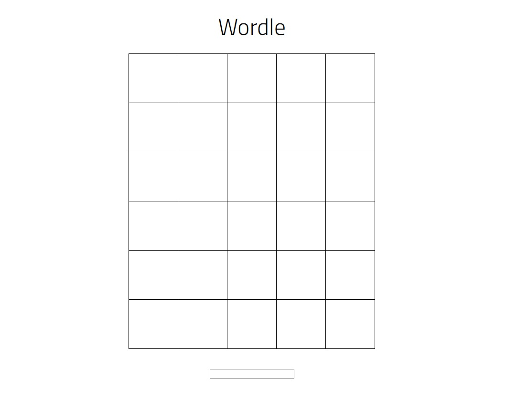

# Wordle_Octoping

   
  
   

## 프로젝트 소개
프론트엔드 관련 지식을 공부해보고 싶어서 시작한 프로젝트입니다.

[NYTimes Wordle](https://www.nytimes.com/games/wordle/index.html)을 참고하여 만들었습니다.

## 기술 스택

| JavaScript |
| :--------: |
|   ![js]    |

 

## 구현 기능

### 기능 1
단어 입력시 정답에 맞춰 알맞는 색깔로 표에 표시됨
### 기능 2
게임 종료시 모달 창을 띄워 게임 결과와 재시작 버튼 표시
### 기능 3
입력값이 올바르지 않을 때 토스트 메시지 표시

 

## 배운 점 & 아쉬운 점
전반적인 CSS 사용법을 익히는 데에 도움이 많이 됐습니다.

개인적으로 만들어본 첫 웹 프로젝트인만큼, 자신감을 키우는 데에 도움이 많이 됐습니다.

CSS에 능통하지는 않아, 글자 입력할 때 애니메이션을 넣는 등의 디자인 적인 부분에 소홀할 수 밖에 없던 점이 아쉽습니다.

<!-- Stack Icon Refernces -->
[js]: https://github.com/Octoping925/readme-template/blob/main/images/stack/javascript.svg
